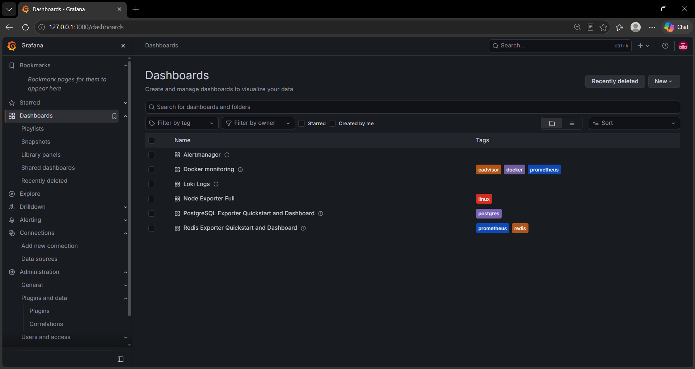
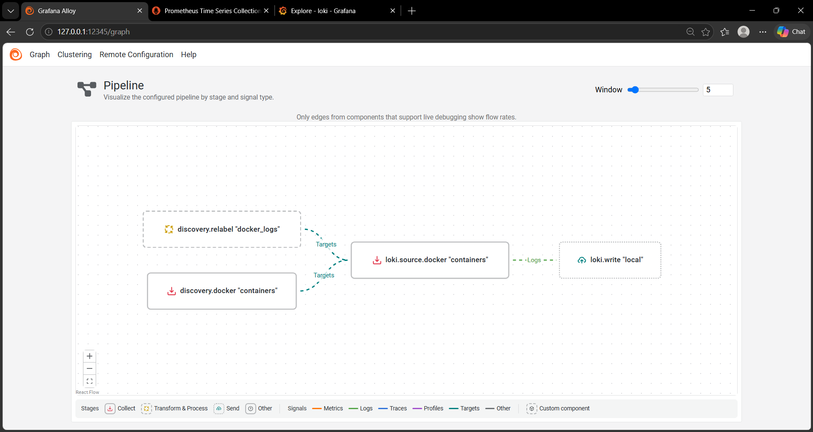
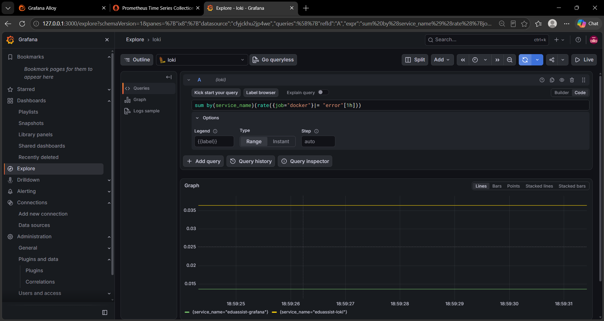
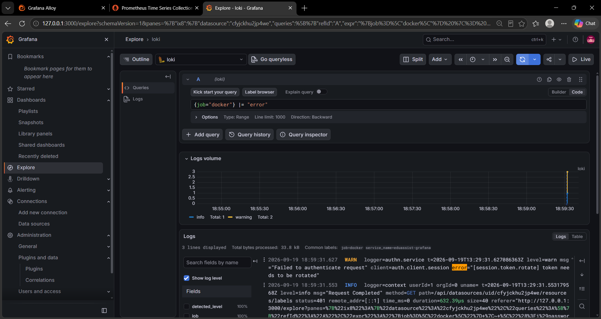
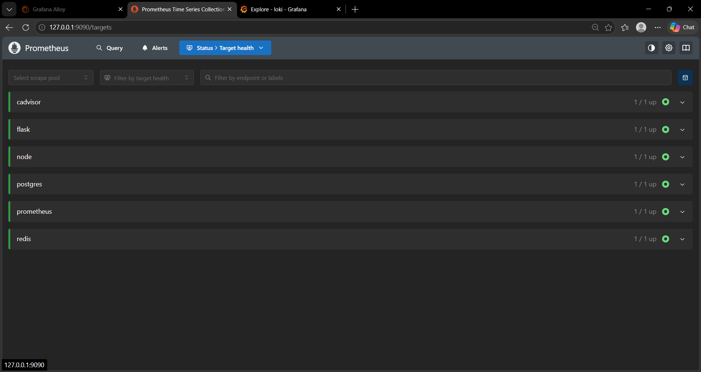
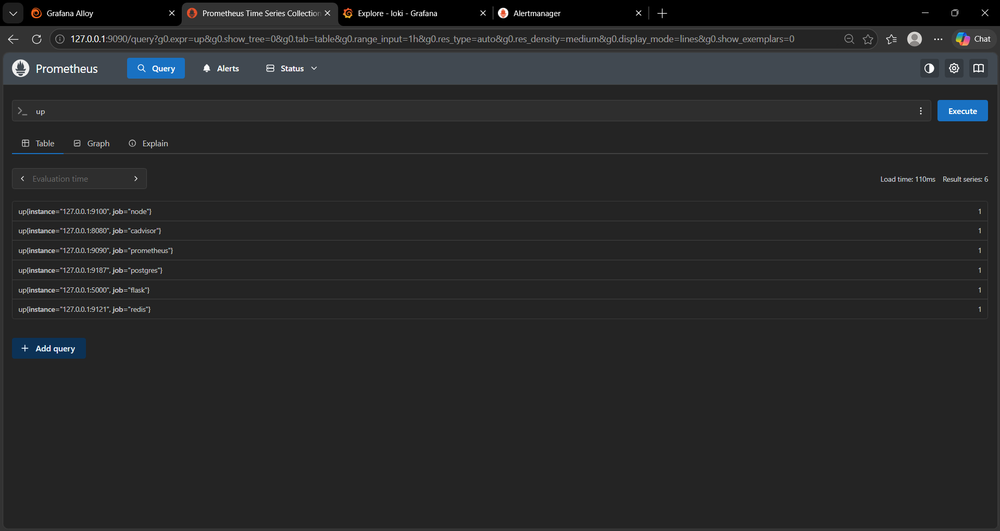
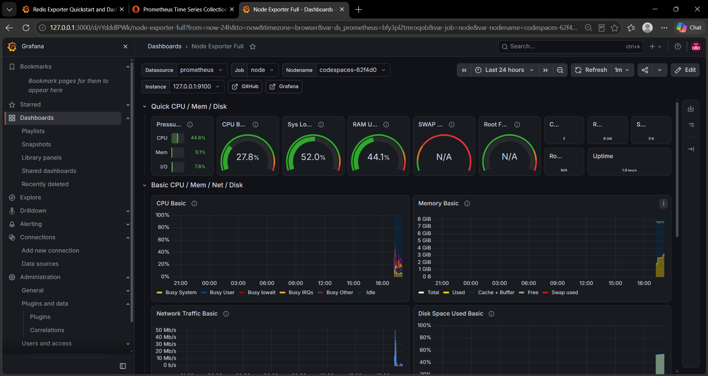
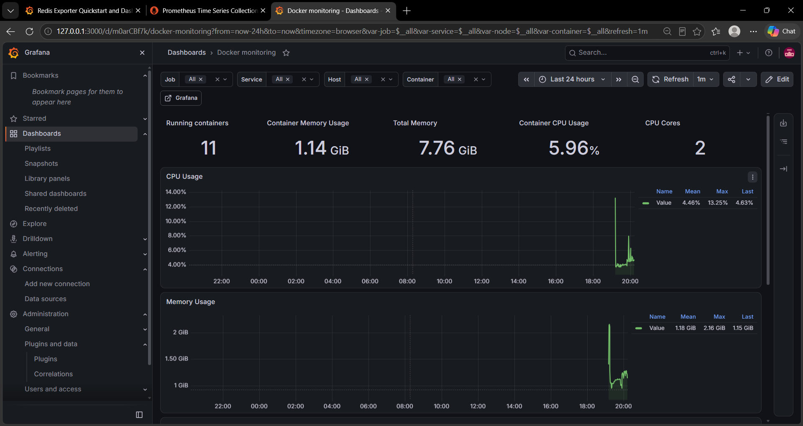
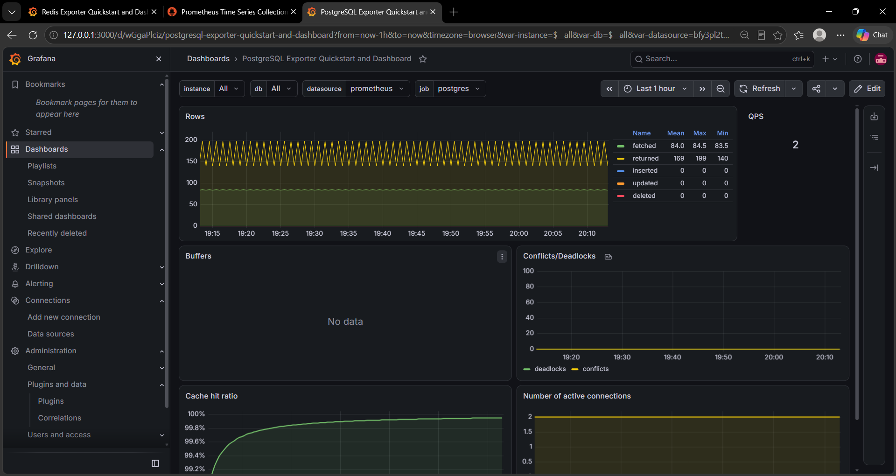
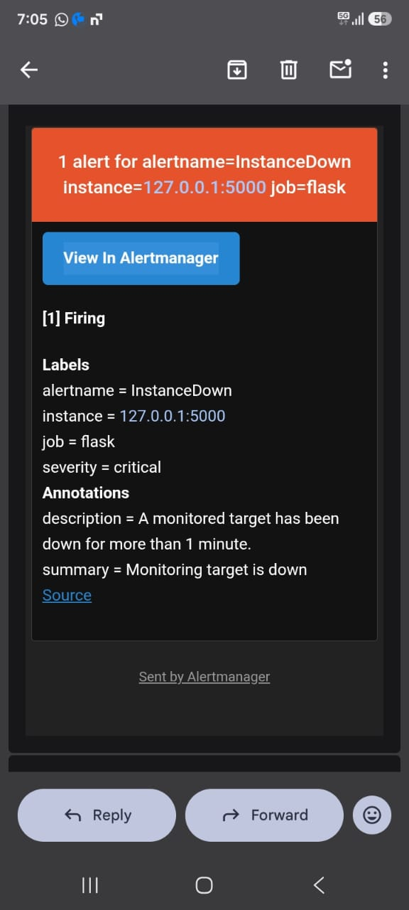

# EduAssist

EduAssist is a Flask-based management system for coaching institutes. It helps manage students, fees, attendance, assignments, quizzes, notifications, teachers, and leads.

## Features

* JWT Authentication
* OTP Email Verification
* Student, Teacher & Owner Management
* Attendance Management
* Fee Management & Reminders
* Assignment & Quiz Management
* Web Notifications
* Lead Management
* Redis + Celery Background Tasks
* Owner & Teacher Dashboards
* Frontend Integration
* Monitoring and Observability

## Project Status

* [x] Backend API
* [x] Database Integration
* [x] Frontend
* [x] Metrics & Monitoring
* [x] Log Aggregation & Alerting
* [ ] Distributed Tracing with OpenTelemetry

## Tech Stack

* Python
* Flask
* SQLAlchemy
* PostgreSQL
* Redis
* Celery
* JWT
* Prometheus
* Grafana
* Loki
* Grafana Alloy
* Alertmanager
* cAdvisor

## Observability

EduAssist includes a monitoring and logging stack for application and infrastructure visibility.

```text
Application / Containers
        |
        +---- Metrics ----> Prometheus ----> Grafana
        |
        +---- Logs -------> Alloy -------> Loki ----> Grafana
        |
        +---- Alerts -----> Alertmanager ----> Email
```

The setup also includes Redis and PostgreSQL exporters, cAdvisor, and Node Exporter.

## Screenshots


### Grafana Dashboard


### Grafana Alloy


### Loki




### Prometheus Targets And Queries




### Node Exporter


### Docker Monitoring


### PostgreSQL Exporter


### Alert



## Installation

### Backend

```bash
git clone https://github.com/imtiyaz-dev432/eduassist-ai.git
cd eduassist-ai

python -m venv .venv
source .venv/bin/activate

pip install -r requirements.txt
```

### Environment Variables

Create a `.env` file:

```env
DATABASE_URL=
JWT_SECRET_KEY=
REDIS_URL=
BREVO_API_KEY=
```

## Run Backend

```bash
flask run
```

The backend runs on:

```text
http://127.0.0.1:5000
```

## Run Celery

### Worker

```bash
celery -A app.celery worker --loglevel=info
```

### Beat

```bash
celery -A app.celery beat --loglevel=info
```

## Run Frontend

```bash
cd frontend
npm install
npm run dev
```

Open the frontend URL shown by the development server.

## Run Monitoring Stack

From the project root:

```bash
docker compose up -d
```

Check running services:

```bash
docker compose ps
```

Useful interfaces:

```text
Grafana        http://127.0.0.1:3000
Prometheus     http://127.0.0.1:9090
Alertmanager   http://127.0.0.1:9093
Loki           http://127.0.0.1:3100
Alloy          http://127.0.0.1:12345
```

Stop the monitoring stack:

```bash
docker compose down
```

## Project Structure

```text
routes/
models/
utils/
migrations/
monitoring/
frontend/
docker-compose.yml
```

## Future Improvements

* OpenTelemetry distributed tracing
* Analytics dashboard
* Payment gateway integration

## Author

Md Imtiyaz
